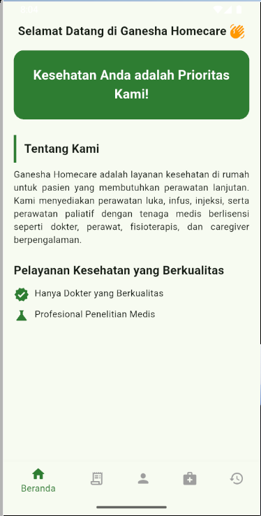
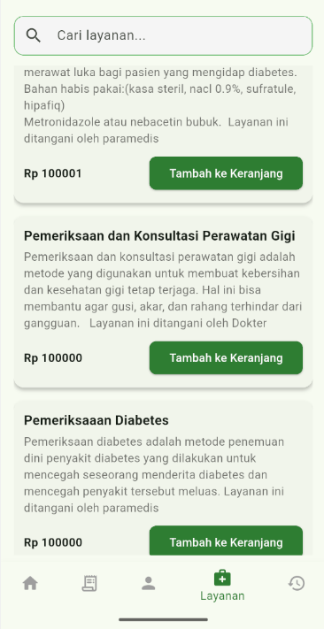
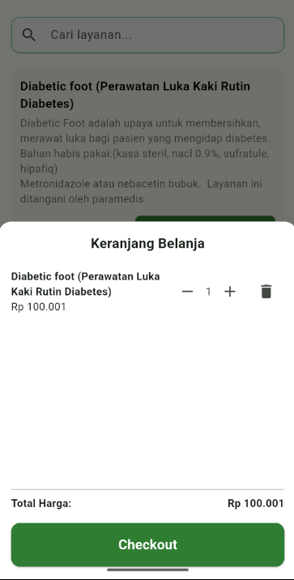
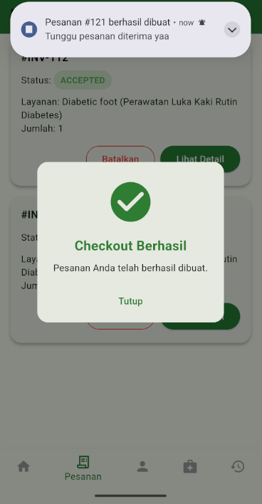
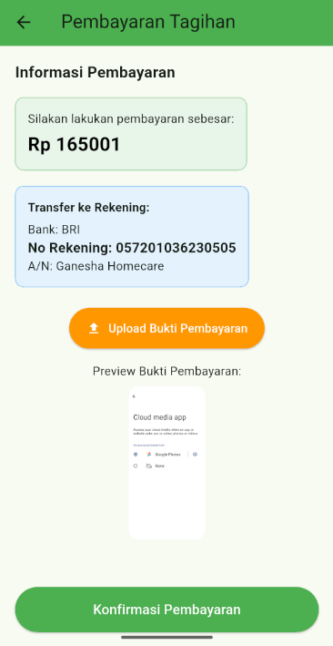
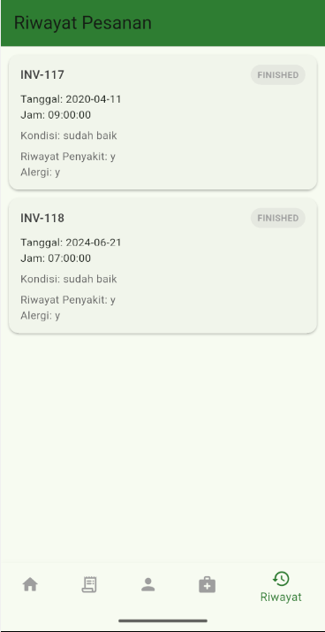

# 🏥 Ganesha Homecare

**Ganesha Homecare** is a homecare service platform consisting of a **mobile app** and a **website**, designed to help elderly patients or post-hospitalization patients manage in-home care services.

- **Website** is used by admins to manage services, schedules, orders, and notifications.  
- **Mobile App** is used by patients to browse services, place orders, and receive real-time notifications.

---

## 🚀 Key Features

### Mobile App (Flutter)
- **Authentication & Security**: Login, Register, Token Refresh, Logout  
- **Profile & Address**: Edit user profile, manage address with dynamic dropdowns (Regency → District → Village), auto-prefill  
- **Services & Orders**: View service list, add to cart, checkout, confirm address  
- **Order Management**: View order list, status: Pending / Accepted / Paying, actions: Detail / Cancel  
- **Real-Time Notifications**: Receive push notifications when admins schedule services or update order status

> ⚠️ The admin website is only used for processing orders and scheduling visits; its source code is not included in this repository.

## Screenshots

### Home Page

  

 

### Service

  

 

### Cart

  

 

### Checkout Notifications

  

 

### Payment

  

 

### History

  

## 📖 References
- [Flutter Docs](https://flutter.dev/docs)  
- [Laravel Docs](https://laravel.com/docs)  
- [Firebase Cloud Messaging](https://firebase.google.com/docs/cloud-messaging)  
- [LocationIQ API](https://locationiq.com)

---

## 📜 License
MIT License © 2026
